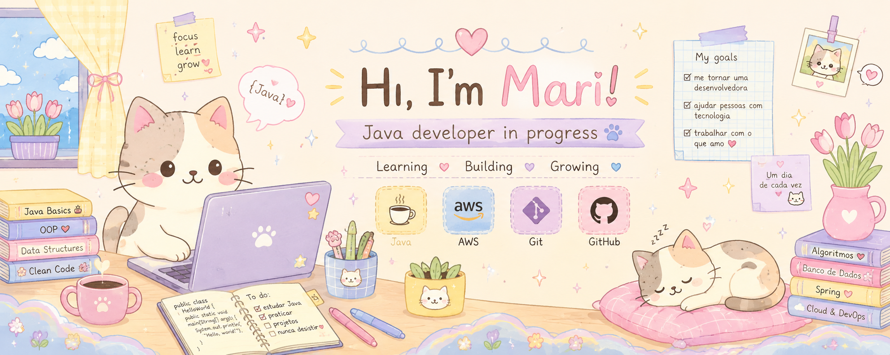
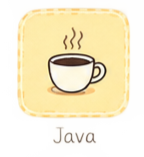
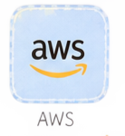
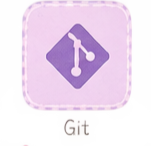
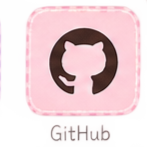
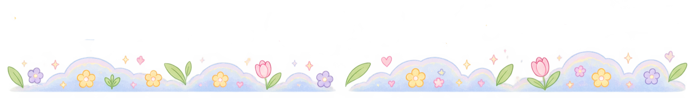

<p align="center">
  
</p>

<p align="center">
  🌷 ☕ 💻 🐱 ☁️ 🌸
</p>

## 👋 Olá!

Sou a Mari, estudante de tecnologia e desenvolvedora **Java em formação**. ☕💻

Estou construindo minha jornada na programação passo a passo, começando pelos fundamentos e transformando cada novo aprendizado em código, exercícios e projetos.

Atualmente, meu principal foco é **Java**, enquanto também começo a explorar o universo de **AWS e Cloud Computing**. ☁️

---

<p align="center">
  
</p>

## 🐱 Minha jornada

Minha jornada na programação está sendo construída com muita prática e curiosidade.

Comecei pelos fundamentos da programação e, atualmente, estou aprofundando meus conhecimentos em Java, buscando entender não apenas *como* escrever um código, mas também *por que* ele funciona.

Meu GitHub acompanha esse processo: aqui estão meus estudos, exercícios e projetos desenvolvidos ao longo dessa caminhada. 🌱

> ☕ Um conceito de cada vez. Um projeto de cada vez. Um commit de cada vez.

---

## 💻 O que estou estudando

### ☕ Java

Atualmente estou focada em construir uma base sólida na linguagem:

* Variáveis e tipos de dados
* Estruturas condicionais
* Loops
* Arrays
* `ArrayList`
* Collections
* Métodos
* Programação Orientada a Objetos
* Exercícios de lógica
* Projetos práticos

<p align="center">
  
</p>

### ☁️ AWS & Cloud

Também estou começando a explorar:

* Conceitos de Cloud Computing
* Servidores e infraestrutura
* Serviços da AWS
* Segurança na nuvem
* Fundamentos de DevOps

---

## 🛠️ Tecnologias

<p align="center">



   



   



   



</p>

<p align="center">
☕ Java &nbsp; • &nbsp; ☁️ AWS &nbsp; • &nbsp; 💜 Git &nbsp; • &nbsp; 🐙 GitHub
</p>

> 🌱 Essa lista cresce conforme avanço nos meus estudos.

---

<p align="center">
  
</p>

## 📚 Projetos

### ☕ Java — Estudos

Repositório dedicado à minha jornada aprendendo Java, reunindo fundamentos, exercícios e projetos desenvolvidos durante meus estudos.

🔗 **[Acessar repositório](https://github.com/Emmed22/java-estudos.git)**

### 🚀 Projetos em construção

Estou desenvolvendo novos projetos conforme avanço nos estudos.

Cada projeto representa uma oportunidade de aplicar na prática aquilo que estou aprendendo. 🐾

---

## ☁️ AWS & próximos passos

Meu objetivo é, aos poucos, conectar meus conhecimentos de desenvolvimento com **Cloud Computing**.

Minha trajetória de estudos atualmente segue esta direção:

```text
☕ Java
   ↓
🧠 Lógica de programação
   ↓
🧩 Programação Orientada a Objetos
   ↓
💻 Projetos
   ↓
☁️ AWS / Cloud
   ↓
⚙️ DevOps
```

Ainda estou no começo dessa jornada, mas quero construir uma base sólida antes de avançar para conceitos mais complexos. 🌱

---

## 🌱 GitHub Stats

<p align="center">


</p>

---

<p align="center">
  
</p>

<p align="center">
  🐾 <i>Aprendendo, construindo e crescendo um commit de cada vez.</i> 🐾
</p>

<p align="center">
  
</p>
